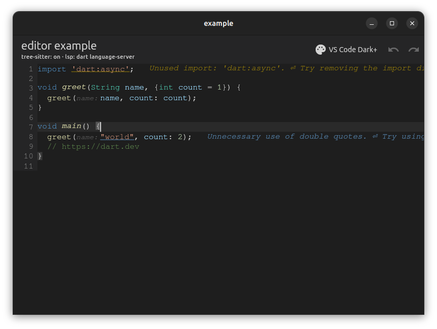
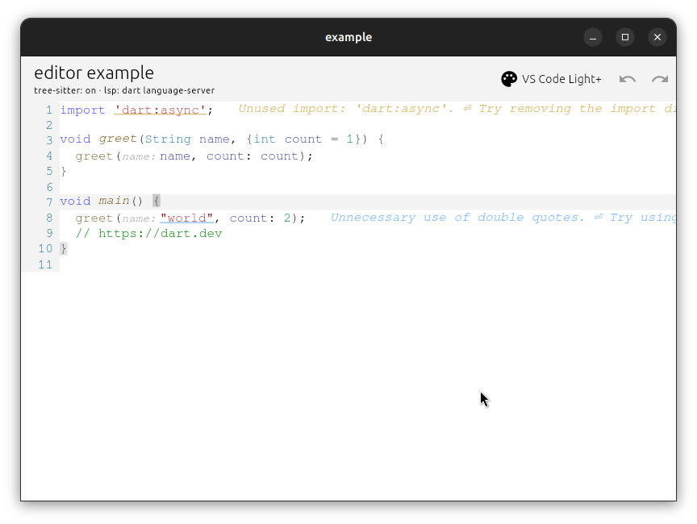
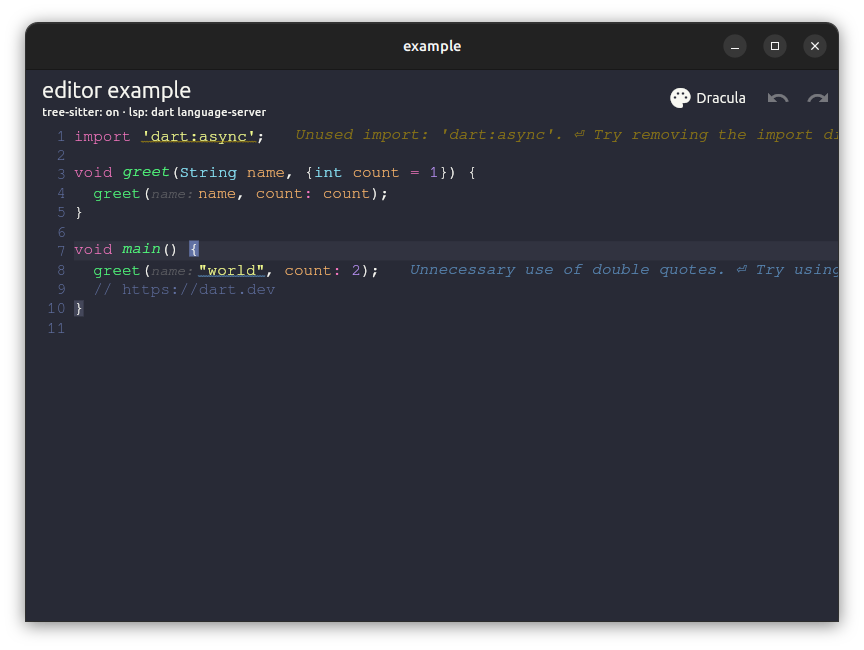
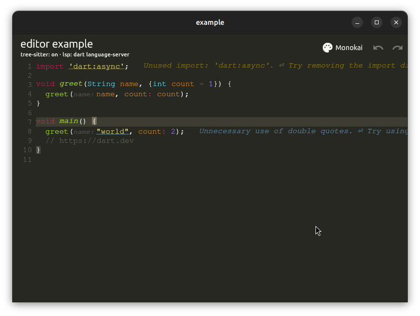
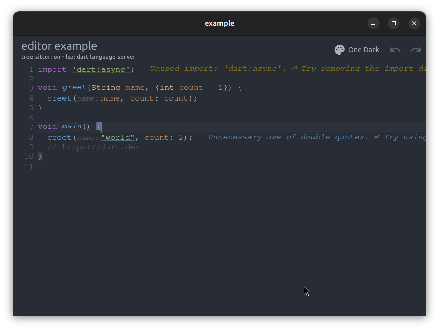
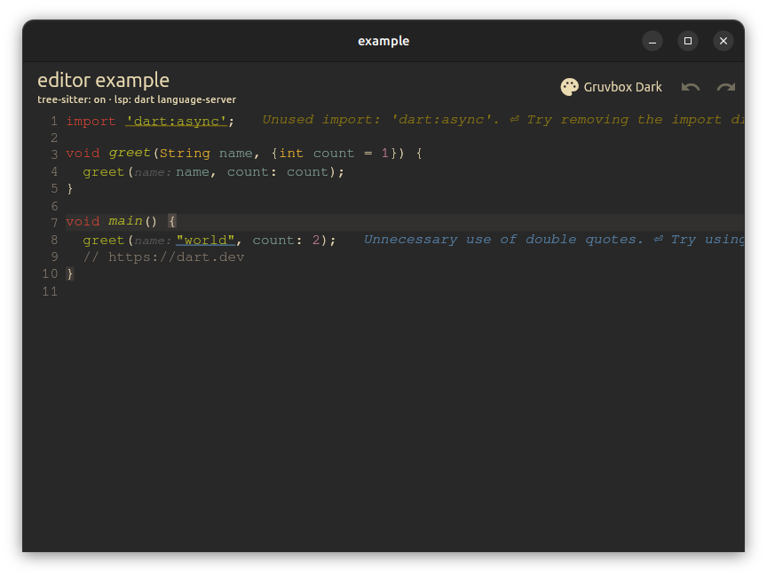
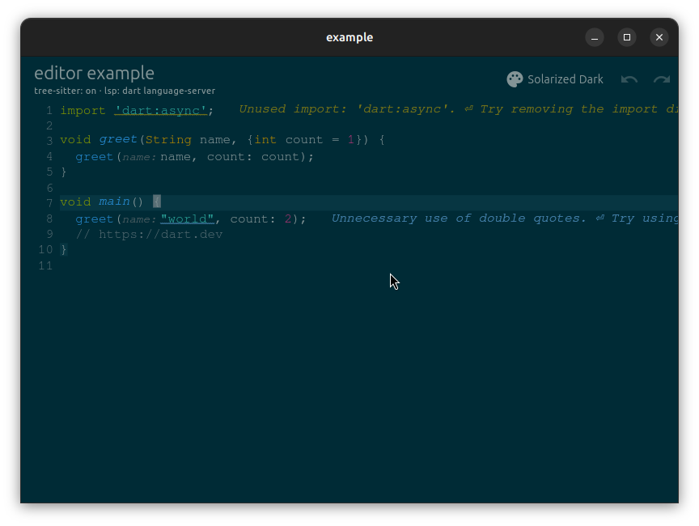
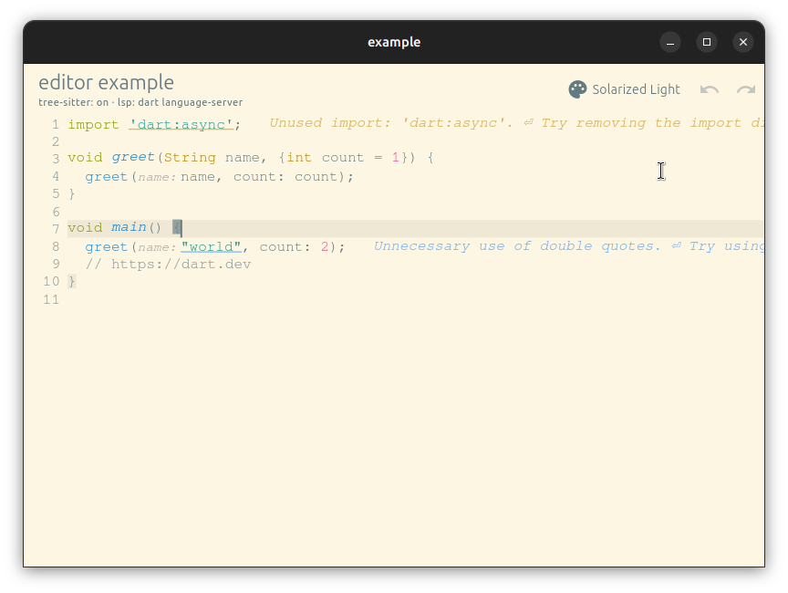
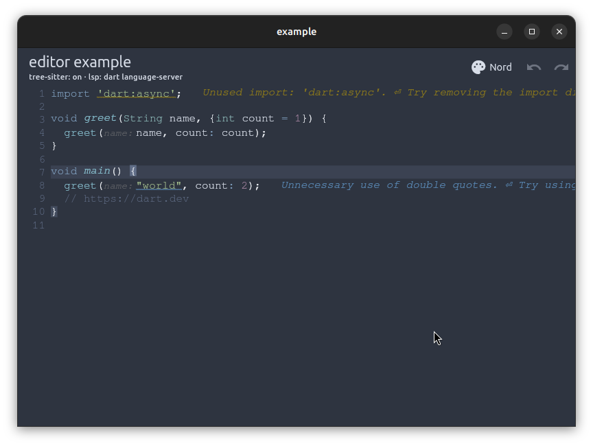

# editor

Встраиваемый текстовый редактор для Flutter: piece tree, транзакции, слои стилей, кастомная отрисовка.

## Демо

Приложение [`example/`](example/): подсветка Dart (tree-sitter и LSP), gutter, диагностики и переключаемые темы оформления.

| VS Code Dark | VS Code Light | Dracula |
| :---: | :---: | :---: |
|  |  |  |

| Monokai | One Dark | Gruvbox Dark |
| :---: | :---: | :---: |
|  |  |  |

| Solarized Dark | Solarized Light | Nord |
| :---: | :---: | :---: |
|  |  |  |

Запуск: `cd example && flutter run` (для tree-sitter на desktop сначала `cd example/native && make`).

## Документация

- [Архитектура](docs/ARCHITECTURE.md)

## Быстрый старт

```dart
final controller = EditorController(
  initialText: 'void main() {}\n',
  host: myHost, // StyleLayer + callbacks
);

EditorView(
  controller: controller,
  showGutter: true,
);
```

## Действия (команды), меню и клавиши

Центральная модель — [EditorActionId]: одно действие вызывается из меню, с клавиатуры или через `controller.perform(...)`.

| Действие | Клавиши по умолчанию |
|----------|----------------------|
| Undo | Ctrl/Cmd+Z |
| Redo | Ctrl/Cmd+Shift+Z, Ctrl/Cmd+Y |
| Копировать | Ctrl/Cmd+C, Ctrl+Insert |
| Вырезать | Ctrl/Cmd+X, Shift+Delete |
| Вставить | Ctrl/Cmd+V, Shift+Insert |
| Выделить всё | Ctrl/Cmd+A |
| Backspace / Delete / Enter / Tab / стрелки | как в системе |

```dart
// Прямой вызов
await controller.perform(EditorActionId.copy);

// Переназначение Ctrl+S (пример: кастомное действие в реестре)
controller.actionRegistry.registerCustom('save', perform: (ctx) async { ... });

final actionConfiguration = EditorActionConfiguration(
  labels: editorActionLabelsFromMaterial(context, undo: 'Отменить'),
  prependedBindings: [
    const EditorKeyBinding(
      action: EditorActionId.paste,
      activator: SingleActivator(LogicalKeyboardKey.keyV, alt: true),
    ),
  ],
  disabledActions: {EditorActionId.cut},
);

EditorView(
  controller: controller,
  actionConfiguration: actionConfiguration,
  menuConfiguration: EditorMenuConfiguration.fromAction(
    actionConfiguration,
    buildItems: (ctx) {
      final items = EditorMenuDefaults.standardItems(ctx);
      items.add(EditorMenuDividerItem());
      items.add(EditorCustomMenuItem(
        label: 'Форматировать',
        actionId: 'format',
        onPressed: () {},
      ));
      return items;
    },
  ),
);
```

- **ПКМ** / **long-press**: контекстное меню.
- **Мобильный toolbar**: те же действия, где есть платформенная кнопка.

Публичные типы: `EditorActionId`, `EditorActionConfiguration`, `EditorKeyBinding`,
`EditorActions`, `EditorActionRegistry`, `EditorController.perform`, а также типы меню
(`EditorMenuItem`, `EditorMenuDefaults`, …).

## Тесты

```bash
dart test test/model test/editing
flutter test
```

## API

Публичный экспорт: `lib/editor.dart` — `Document`, `EditorController`, `EditorView`, `StyleLayer`, `TextOffset`, и др.
