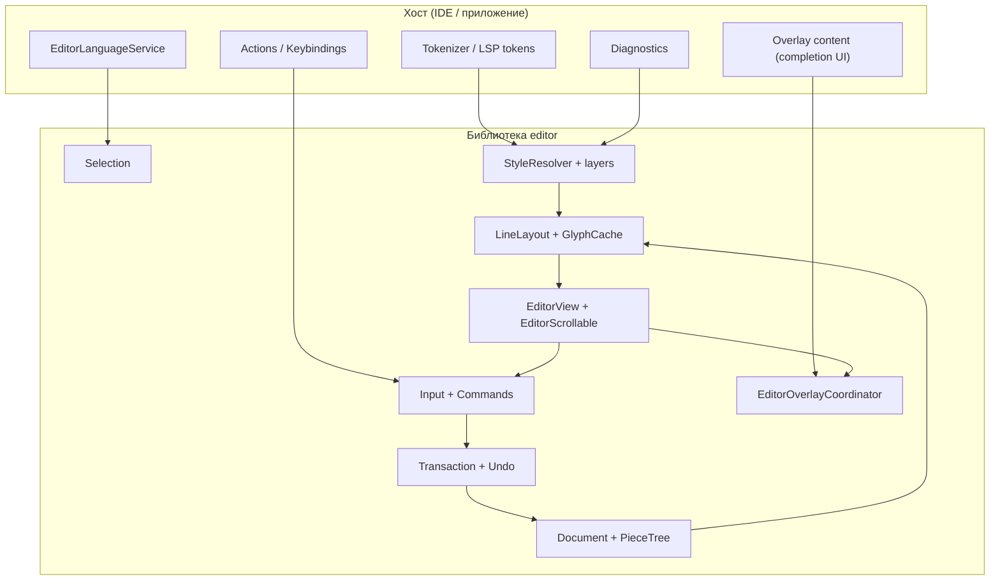
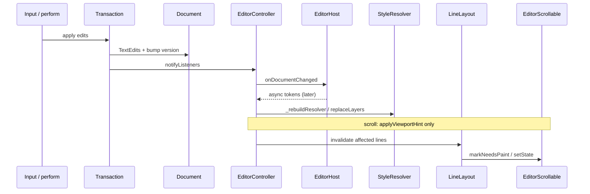
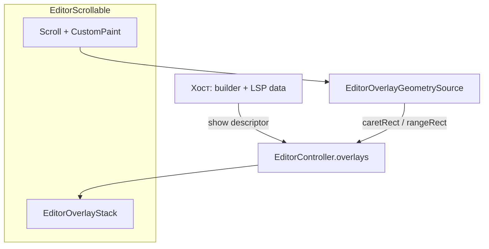

# Архитектура библиотеки `editor`

Документ описывает архитектуру встраиваемого текстового редактора для Dart / Flutter.
Это **не** полнофункциональная IDE, а библиотека «окна редактирования», которую встраивают в редактор кода или другое приложение.

Ориентиры по UX и разделению ответственности: Monaco (VS Code), CodeMirror 6, Zed.

---

## 1. Цели и границы

### 1.1 В зоне библиотеки

- Буфер текста (**piece tree**), атомарные правки, undo / redo
- Каретка, выделение, multi-cursor
- Раскладка строк (включая word wrap), координаты глифов, hit-test, скролл viewport
- Слияние стилей отображения и отрисовка текста с полным контролем (не `TextField`)
- Базовые команды редактирования и расширяемый реестр действий ([EditorActionId])
- Диагностика (подчёркивания, inline-метки), inlay hints, подсветка каретки
- **Overlay** — всплывающие панели (completion, hover, signature help, sticky UI)
- Необязательная интеграция с языковым сервисом ([EditorLanguageService])

### 1.2 Вне библиотеки (хост)

- Файловая система, LSP-транспорт, git, панели, вкладки, глобальный поиск
- Семантика языка (через API слоёв стилей и/или LSP в example)
- Тема приложения, меню, иконки, настройки проекта

### 1.3 Ключевые принципы

| Принцип | Формулировка |
|--------|--------------|
| Единый источник текста | Содержимое хранит только **Document** |
| Стили не в буфере | Цвет символа не является полем символа в модели |
| Правки только через движок | Любое изменение текста — **Transaction** → undo и инвалидация |
| UTF-16 в API | Offset и column — в code units, как у `String` в Dart и LSP |
| Слои стилей с приоритетом | Итоговый вид символа определяет **StyleResolver** |
| Viewport-aware подсветка | Хост получает **ViewportStyleScope**; syntax-слои сужают бинарный поиск по токенам |

---

## 2. Слои системы



### 2.1 Model — «что написано»

**Document** — изменяемый текст. Реализация буфера: **PieceTree** (`lib/src/model/buffer/piece_tree.dart`) + **LineIndex** для O(1) `lineStart` / `positionAt` при типичных правках.

**Version** — монотонно растёт после каждого пакета `apply`; подписчики и слои стилей синхронизируются по `document.version`.

**Система координат:**

| Тип | Описание |
|-----|----------|
| `offset` / `TextOffset` | Индекс в UTF-16 code units, `[0, length]` |
| `Position` | `(line, column)`, column в code units |
| `Range` | Полуоткрытый `[start, end)` в offset |
| `TextAffinity` | `upstream` / `downstream` на границах surrogate pair и переносов |

### 2.2 Editing — «как меняется текст»

**Transaction** — единственная точка применения `TextEdit` к Document; обновляет selection внутри транзакции.

**UndoStack** — группировка по транзакциям; merge смежного ввода (опционально).

**CommandRegistry** — встроенные команды и регистрация кастомных действий хоста.

### 2.3 View / Layout — «где это на экране»

**LineLayout** — строки документа → визуальные строки (word wrap), метрики глифов, `getBoxesForRange`, кэш высот блоков.

**ViewportState** — `firstVisibleLine`, `scrollOffset`, размеры viewport; расчёт последней видимой строки в **пикселях** (`theme.lineHeightPx`).

**EditorScrollable** — ядро отрисовки: layout, paint, скролл, синхронизация **ViewportStyleScope** с контроллером, частичная инвалидация строк.

### 2.4 Integration — «как подключается хост»

**EditorController** — фасад: document, selection, resolver, diagnostics, `setHost`, `setLanguageService`, `refreshStyleLayers`, `syncStyleViewportFromEditorState`.

**EditorView** — тонкая обёртка над `EditorScrollable`.

**EditorHost** — поставщик **StyleLayer** и колбэки `onDocumentChanged` / `onSelectionChanged` / `onNavigate`.

**EditorLanguageService** — асинхронные document highlights, linked editing, inlay hints, link targets (см. §8).

**EditorOverlayCoordinator** — стек всплывающих панелей поверх viewport (см. §7.5).

---

## 3. Поток данных при правке



**Запрет:** UI и хост не изменяют `Document` в обход **Transaction**.

После асинхронной токенизации хост вызывает `EditorController.refreshStyleLayers()` (часто из `addPostFrameCallback`), предварительно синхронизируя viewport через `syncStyleViewportFromEditorState`.

---

## 4. Структура пакета

Актуальная раскладка (основные модули):

```
lib/
  editor.dart                      # публичный export
  src/
    model/
      document.dart
      document_change.dart
      buffer/
        piece_tree.dart
        line_index.dart
      position.dart
      text_edit.dart
      transaction.dart
    selection/
    editing/
      edit_engine.dart
      undo_stack.dart
      commands/
      clipboard_text.dart
      command_registry.dart
    styling/
      style_resolver.dart
      style_span.dart
      style_layer.dart
      style_span_mask.dart          # проекция pending-правок на snapshot токенов
      sorted_style_spans.dart       # бинарный поиск + SpanSearchBounds
      viewport_style_scope.dart     # scroll vs caret для хоста
      layers/
        base_style_layer.dart
        syntax_style_layer.dart
        pending_shifted_syntax_layer.dart
        decoration_style_layer.dart
        transient_style_layer.dart
    layout/
      line_layout.dart
      glyph_cache.dart
      viewport.dart
      visual_line.dart
      styled_run_layout.dart
    view/
      editor_view.dart
      editor_scrollable.dart
      layers/
        editor_layers_painter.dart
        gutter_layer.dart
      input/
      menu/
      pointer/
      inlay/
    overlay/
      editor_overlay_anchor.dart
      editor_overlay_coordinator.dart
      editor_overlay_descriptor.dart
      editor_overlay_dismiss.dart
      editor_overlay_geometry.dart
      editor_overlay_layout.dart
      editor_overlay_presenter.dart
      editor_overlay_resizable.dart
    api/
      editor_controller.dart
      editor_host.dart
      editor_language_service.dart
      editor_overlay.dart
      editor_action.dart
      editor_menu.dart
      selection_change.dart
    decorations/
      editor_region_block.dart      # модель блока-рамки
      region_block_geometry.dart    # геометрия/развод пересечений (тестируемая)
    diagnostics/
    highlight/
    inlay/
    navigation/
```

Демо LSP и overlay: `example/lib/` (`DartSyntaxHighlighter`, `overlay/editor_overlay_demos.dart`, `main.dart`).

**Публичный API** — `lib/editor.dart`: контроллер, виджет, позиции, правки, тема, слои стилей, viewport, маски pending. Детали piece tree и paint остаются в `src/`.

---

## 5. Владение форматированием

### 5.1 Постановка

У одного offset может быть разный цвет, фон, подчёркивание. Итог даёт **StyleResolver** по приоритетам слоёв. **Document** хранит только текст.

### 5.2 Слои в контроллере (снизу вверх)

| Слой | Источник | Назначение |
|------|----------|------------|
| **BaseStyleLayer** | `EditorTheme` | Цвет/шрифт по умолчанию |
| **Syntax** (хост) | `EditorHost.styleLayersFor` | LSP semantic tokens, tokenizer |
| **DecorationStyleLayer** | `setDiagnostics` | Волнистые подчёркивания, фон строк |
| **TransientStyleLayer** | библиотека | Selection, bracket match, preedit, language highlights |

Отдельного класса «Semantic» в библиотеке нет: семантика хоста попадает в **SyntaxStyleLayer** / **PendingShiftedSyntaxLayer**.

### 5.3 Контракт слоя

```dart
abstract interface class StyleLayer {
  String get id;
  int? get validForDocumentVersion;
  Iterable<StyleSpan> spansForRange(Range range);
}
```

**StyleResolver** для строки документа собирает span'ы со всех слоёв (для syntax — один вызов `spansForRange` на слой за строку, не на каждый сегмент), сортирует по приоритету и строит **AttributedRun**.

**styleEpoch** — инвалидация кэша layout при смене слоёв; `replaceLayers` не пересоздаёт список, если ссылки на слои те же (типичный keystroke с обновлением `PendingShiftedSyntaxLayer` in-place).

### 5.4 Viewport-aware syntax (большие файлы)

Проблема: snapshot LSP на десятки тысяч символов (~3000+ span'ов); пересчёт и полный бинарный поиск на каждый кадр недопустим.

**ViewportStyleScope** (`fromViewport`):

- **documentRange** — видимая полоса **scroll** (± overscan, cap `kMaxStyleViewportLines`), высота строки в **px** (`lineHeightPx`, не множитель темы).
- **caretSearchRange** — дополнительная полоса вокруг каретки, только если каретка **вне** видимого scroll; без непрерывного «моста» от строки 0 до 1500.
- При cap off-screen каретки центр окна — середина **scroll**, не позиция каретки.

**EditorScrollable** вызывает `controller.computeStyleViewportScope()` / `updateStyleViewport`. При прокрутке — `applyViewportHint` без полного `styleLayersFor`.

**SyntaxStyleLayer** / **PendingShiftedSyntaxLayer** хранят `spanSearchBounds` — срез `sorted[lo..hi)` для бинарного поиска в `spansForSortedRange`. Пустое пересечение с диапазоном не откатывается к «весь файл» (соседний span или merge scroll+caret).

### 5.5 Pending snapshot (лаг LSP)

Пока `document.version` > `highlightVersion` хост отдаёт **PendingShiftedSyntaxLayer**:

- Базовый отсортированный snapshot LSP.
- Журнал **StyleChange** ([style_span_mask.dart](lib/src/styling/style_span_mask.dart)): сдвиг span'ов, coalesce вставок, `clipBefore` при paste/многострочных правках.
- Проекция `spansForRange` без материализации всего массива на каждый keystroke.

Example: `DartSyntaxHighlighter` — debounce full `semanticTokens`, немедленный full при undo, batch `didChange` в LSP.

### 5.6 Инвалидация

`DocumentChange` содержит правки и `affectedLineRange`. Хост обновляет токены асинхронно; слои с `validForDocumentVersion` игнорируются resolver'ом при рассинхроне.

**Запреты** (без изменений): синхронный LSP на каждый кадр; запись стилей в Document; один `TextStyle` на весь виджет.

---

## 6. Отрисовка

**EditorLayersPainter** / **EditorScrollable** (снизу вверх):

1. Фон, current line, gutter (опционально)
2. Блоки-рамки (**EditorRegionBlock**, см. §6.1)
3. Текст по **AttributedRun** (`GlyphCache`, моноширинный/пропорциональный шрифт)
4. Inlay hints (виртуальные аннотации)
5. Selection, carets
6. Diagnostics / link underline

### 6.1 Блоки-рамки (визуальные регионы)

**Задача:** подсветить не «выделение текстом», а **визуальный блок** — рамка и опциональная заливка вокруг непрерывного `Range`, который может быть многострочным и иметь разную ширину на разных строках (как подсветка SQL-запроса в DataGrip).

| Компонент | Роль |
|-----------|------|
| [EditorRegionBlock](../lib/src/decorations/editor_region_block.dart) | Модель: `range`, `borderColor?`, `fillColor?`, `id?` |
| [RegionBlockGeometry](../lib/src/decorations/region_block_geometry.dart) | Геометрия без Canvas: нормализация rect'ов, детектор и развод пересечений (unit-тестируемые) |
| [EditorController.setRegionBlocks](../lib/src/api/editor_controller.dart) | Хранение списка блоков + `notifyListeners` |
| [EditorLayersPainter](../lib/src/view/layers/editor_layers_painter.dart) | Отрисовка: ступенчатый контур, заливка, рамка «внутрь» |

**Использование (хост):**

```dart
controller.setRegionBlocks([
  EditorRegionBlock(
    range: Range(10, 45),
    // borderColor можно не задавать — возьмётся из темы.
    fillColor: const Color(0x224C8BF5),
  ),
]);
```

**Внешний вид задаёт тема** ([EditorTheme](../lib/src/styling/editor_theme.dart)), а не модель блока:

| Поле темы | Назначение |
|-----------|------------|
| `regionBlockPaddingX` | Внешний отступ контура по X |
| `regionBlockPaddingY` | Отступ по Y как **inset внутрь строки** (блок не выходит за высоту визуальной строки) |
| `regionBlockBorderWidth` | Толщина рамки; рамка рисуется **внутрь** фигуры (`clipPath` + stroke удвоенной толщины) |
| `regionBlockCornerRadius` | Радиус скругления углов однострочного блока |
| `regionBlockBorderColor` | Цвет рамки по умолчанию, когда `EditorRegionBlock.borderColor == null` |

**Геометрия и инварианты:**

- Прямоугольники по визуальным строкам даёт `LineLayout.getBoxesForRange` — высота сегмента равна высоте визуальной строки, ширина повторяет фактическую ширину текста.
- Многострочный блок рисуется **единым ступенчатым контуром**: правая грань идёт сверху вниз со «ступеньками», левая — снизу вверх; между строками нет внутренних линий.
- **Развод пересечений** (`RegionBlockGeometry.avoidOverlaps`): пересекающиеся по X и Y сегменты разных блоков не рисуются друг на друге — более левый сегмент **сужается** (сегменты не сдвигаются). Конфликт ищется по любой паре сегментов, без группировки по строкам.
- **Вложенные блоки не режутся**: если один `range` полностью содержит другой, внешний блок остаётся целым, внутренний рисуется поверх. Порядок отрисовки — в два прохода: сначала заливки всех блоков, затем рамки; рамки внешних (более длинных `range`) рисуются последними.
- Блоки — чисто визуальный слой: не участвуют в hit-test, не меняют selection и текст.

Тесты геометрии: [test/decorations/region_block_overlap_test.dart](../test/decorations/region_block_overlap_test.dart).

**Оптимизации для больших файлов:**

- Прыжок к первой видимой строке по `lineIndexForDocumentY` при paint
- Быстрый путь высоты строк без wrap (`LineLayout`)
- Селективная инвалидация `maxLinePaintWidth`
- `markNeedsPaint` без `setState` на части путей прокрутки/правок

**Word wrap:** визуальная строка ≠ строка документа; на границах wrap обязателен **TextAffinity**.

---

## 7. Ввод, команды, буфер обмена

**EditorInputHandler** / **EditorTextInputClient** — клавиатура и IME.

Центральная модель действий — **EditorActionId** + `EditorController.perform` / `executeCommand`.

| Компонент | Роль |
|-----------|------|
| `clipboard_text.dart` | Copy/paste, мультикурсор + N строк буфера |
| `EditorMenuConfiguration` | Контекстное меню, toolbar |
| `readOnly` | Cut/paste блокируются; undo через API возможен |

**Multi-cursor:** правки с конца документа или одна транзакция.

### 7.5 Overlay (всплывающие панели)

**Inline vs floating:** inlay hints, squiggles и ghost text рисуются в **EditorLayersPainter** (привязка к offset в документе). Completion, hover, signature help и find bar — **overlay**: Flutter-виджеты в `Stack` поверх viewport, якорь в экранных координатах.



| Компонент | Роль |
|-----------|------|
| [EditorOverlayCoordinator](lib/src/overlay/editor_overlay_coordinator.dart) | `show` / `hide` / `hideAll`, приоритеты, dismiss по scroll/doc/selection |
| [EditorOverlayDescriptor](lib/src/overlay/editor_overlay_descriptor.dart) | id, якорь, layout, dismiss, `children` (nested details) |
| [EditorOverlayAnchor](lib/src/overlay/editor_overlay_anchor.dart) | `EditorCaretOverlayAnchor`, `EditorRangeOverlayAnchor`, `EditorPointOverlayAnchor`, `EditorViewportOverlayAnchor` |
| [EditorOverlayLayoutPolicy](lib/src/overlay/editor_overlay_layout.dart) | placement, flip, clamp, max/preferred size, `resizable` |
| [EditorOverlayDismissPolicy](lib/src/overlay/editor_overlay_dismiss.dart) | outside click, Escape, scroll, document/selection change, `trackAnchorOnScroll` |
| [EditorOverlayGeometrySource](lib/src/overlay/editor_overlay_geometry.dart) | `caretRectInGlobal`, `rangeRectInGlobal`, `viewportRectInGlobal` |
| [EditorOverlayStack](lib/src/overlay/editor_overlay_presenter.dart) | отрисовка стека, scrim, focus scope при `capturesKeyboard` |
| [EditorResizablePanel](lib/src/overlay/editor_overlay_resizable.dart) | изменяемый размер documentation pane |

**Жизненный цикл:**

1. Хост вызывает `controller.overlays.show(EditorOverlayDescriptor(...))`.
2. [EditorScrollable](lib/src/view/editor_scrollable.dart) регистрирует [EditorScrollableOverlayGeometry](lib/src/overlay/editor_overlay_geometry.dart) через `attachOverlayGeometry`.
3. Coordinator разрешает якорь (`resolveOverlayAnchorRect`), считает позицию (`computeOverlayLayout`), рендерит панели.
4. При scroll / правке / смене каретки — `onScroll`, `onDocumentChanged`, `onSelectionChanged`, `refreshAnchors` (из `_onControllerChanged` и scroll listeners).
5. Верхний overlay с `capturesKeyboard: true` блокирует [EditorInputHandler] (`_blocksEditorInput`).

**Вложенность:** `EditorOverlayDescriptor.children` — дочерние панели (например, documentation справа от completion list). Якорь child = bbox родителя после measure/resize. `exclusiveWithinKind` для child обычно `false`, чтобы не закрывать parent.

**Конфликты:** `priority` + `supersedesLowerPriority`; `EditorOverlayKind` + `exclusiveWithinKind` (только root overlays).

**Пример (хост):**

```dart
controller.overlays.show(
  EditorOverlayDescriptor(
    id: 'completion',
    kind: EditorOverlayKind.completion,
    priority: 100,
    capturesKeyboard: true,
    anchor: EditorCaretOverlayAnchor(replaceRange: partialTokenRange),
    layout: const EditorOverlayLayoutPolicy(maxHeight: 280, preferredWidth: 320),
    dismissPolicy: const EditorOverlayDismissPolicy(
      scroll: false,
      trackAnchorOnScroll: true,
    ),
    builder: (context, session) => CompletionListWidget(...),
    children: [
      EditorOverlayDescriptor(
        id: 'completion-details',
        layout: const EditorOverlayLayoutPolicy(
          placement: EditorOverlayPlacement.besideEnd,
          resizable: true,
          preferredWidth: 360,
        ),
        anchor: const EditorViewportOverlayAnchor(),
        builder: (context, session) => EditorResizablePanel(
          initialSize: const Size(360, 240),
          onResize: session.resize,
          child: DocumentationView(...),
        ),
      ),
    ],
  ),
);
```

Демо без LSP: [example/lib/overlay/editor_overlay_demos.dart](../example/lib/overlay/editor_overlay_demos.dart). **LSP:** [dart_lsp_overlay_controller.dart](../example/lib/overlay/dart_lsp_overlay_controller.dart) — `textDocument/completion`, `completionItem/resolve`, `hover`, `signatureHelp` через [DartLanguageService](../example/lib/lsp/dart_language_service.dart). Меню **Overlays** и Ctrl+Space в example.

Контекстное меню пока на `ContextMenuController` (отдельный путь); его можно позже перевести на `overlays`.

---

## 8. События и языковой сервис

| API | Когда | Назначение |
|-----|-------|------------|
| `DocumentChange` | После commit | LSP `didChange`, повторная токенизация |
| `SelectionChange` | Смена selection | Status bar, documentHighlight |
| `EditorLanguageService` | Debounced async | Occurrences, linked editing, inlay, links |
| `EditorLanguageService` (хост) | По запросу overlay | `completions`, `hover`, `signatureHelp` |
| `EditorHost.onNavigate` | Ctrl+клик | Переход по `EditorDocumentLocation` |

**EditorLanguageService** — опционально; контроллер отбрасывает устаревшие ответы по generation + version. Overlay-запросы (`completions`, `hover`, `signatureHelp`) — отдельный [EditorOverlayLanguageService](../lib/src/api/editor_overlay_language_service.dart); хост вызывает их из overlay-контроллера (см. `example/lib/overlay/dart_lsp_overlay_controller.dart`).

---

## 9. Публичные контракты

### 9.1 EditorController (основное)

- `document`, `selection`, `viewport`, `resolver`, `theme`
- `apply`, `executeCommand`, `perform`, `undo` / `redo`
- `setHost`, `setDiagnostics`, `setRegionBlocks`, `setLanguageService`, `refreshStyleLayers`
- `overlays` ([EditorOverlayCoordinator]), `overlayGeometry`, `attachOverlayGeometry`
- `styleViewport`, `syncStyleViewportFromEditorState`, `computeStyleViewportScope`
- `readOnly`, `ChangeNotifier`

### 9.2 EditorHost

```dart
abstract mixin class EditorHost {
  List<StyleLayer> styleLayersFor(
    int documentVersion, {
    ViewportStyleScope? viewport,
  });

  void onDocumentChanged(DocumentChange change) {}
  void onSelectionChanged(SelectionChange change) {}
  String? get editorDocumentUri => null;
  void onNavigate(EditorDocumentLocation location) {}
}
```

Хост возвращает `null`/пустой список, пока токены не готовы. Viewport передаётся из контроллера при каждой пересборке resolver.

### 9.3 EditorView

```dart
class EditorView extends StatefulWidget {
  const EditorView({
    required this.controller,
    this.host,
    this.showGutter = false,
    // actionConfiguration, menuConfiguration, ...
    super.key,
  });

  final EditorController controller;
  final EditorHost? host;
}
```

`host` можно задать и через `EditorController(..., host:)` + `setHost`.

---

## 10. Статус реализации

| Область | Статус |
|---------|--------|
| Piece tree, LineIndex, Position | ✅ |
| Transaction, Undo, команды, multi-cursor | ✅ |
| LineLayout, wrap, GlyphCache | ✅ |
| StyleResolver, Base / Syntax / Decoration / Transient | ✅ |
| EditorView, scroll, gutter, selection, caret | ✅ |
| Viewport-aware syntax, pending shift, span mask | ✅ |
| Diagnostics, inlay hints | ✅ |
| Блоки-рамки (EditorRegionBlock) | ✅ |
| EditorLanguageService (API) | ✅ |
| EditorActionId, меню, clipboard | ✅ |
| Link navigation (Ctrl+клик) | ✅ |
| EditorOverlayCoordinator, geometry, nested panels | ✅ |
| EditorLanguageService completion / hover / signature (API) | ✅ [EditorOverlayLanguageService] |
| LSP completion / hover / signature в example | ✅ |
| LSP completion / hover / signature в EditorLanguageService | ❌ / хост |
| LSP semantic tokens range/delta в Dart analyzer | ❌ (только full в example) |
| Minimap, blame, injection grammars | ❌ / хост |
| Attributed text в Document | ❌ (не цель v1) |

Unit/widget-тесты: `test/`, `flutter test` (model, styling, layout, navigation).

---

## 11. Зафиксированные решения

1. **UTF-16** во всех публичных типах позиций.
2. **Plain text** в Document; стили только через слои.
3. **Правки** только через **Transaction**.
4. **Кэш layout** зависит от `document.version`, `styleEpoch`, затронутых строк и метрик viewport.
5. **Viewport для токенов** — scroll в `documentRange`; off-screen caret — отдельный `caretSearchRange`; merge индексов без непрерывного docRange.
6. **lineHeightPx** для `lastVisibleLine`, не `theme.lineHeight` (множитель).

---

## 12. Связанные документы

- [README.md](../README.md) — быстрый старт, действия, тесты
- [CHANGELOG.md](../CHANGELOG.md) — история изменений
- `example/` — демо с Dart Analysis Server и overlay (меню **Overlays**, Ctrl+Space)
- Исходники: `lib/src/`, публичный API: `lib/editor.dart`

При изменении архитектуры обновляйте этот файл и при необходимости README.
